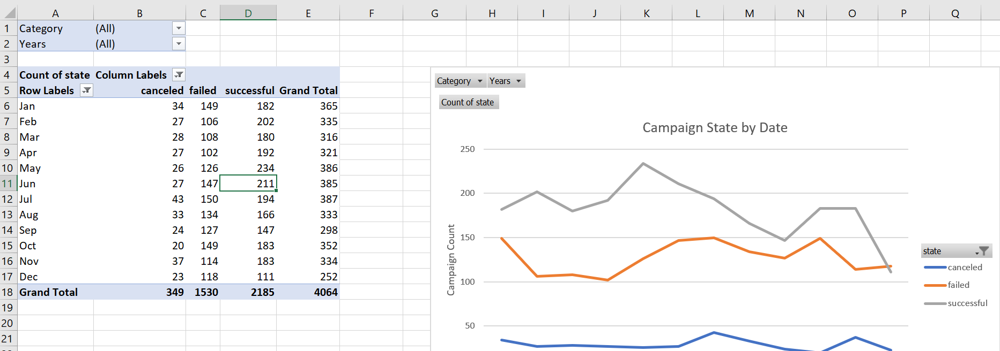

# Excel Homework: Kickstart My Chart
Files for Homework #1 [(Excel Homework)](StarterBook.xlsx) for the UCF Data Analytics &amp; Visualization Bootcamp Dec. 19 2020

In this homework, we organize and analyze a database of 4,000 Kickstarter projects in order to find any hidden market trends. 

## Starter Table

This figure shows the provided table wih the 4,000 past Kickstarter projects.  

  * The "state" column has been color coded depending on the results of the campaign, green=successful, red=failed, gray=canceled, blue=live.  The "percent funded" column uses a three-color scale, showing a dark shade of red for 0, transitioning to green at 100% and blue at 200% funding.

  * The `Average Donation` column uses a formula to uncover how much each backer for the project paid on average.

  * The `Category and Sub-Category` column has been split into two additional columns, one for `Category` and one for `Sub-Category`.
  
  ## Category Stats

  

  This worksheet has a pivot table that analyzes the starter table, counting how many campaigns were successful, failed, canceled, or are currently live per **category**.  It also includes a stacked column pivot chart that can be filtered by country.
  
  ## Subcategory Stats

  

  This worksheet has a pivot table that analyzes the starter table, counting how many campaigns were successful, failed, canceled, or are currently live per **sub-category**.  It also includes a stacked column pivot chart that can be filtered by country.  It also includes a stacked column pivot chart that can be filtered by country and parent-category.
  
  ## Outcomes Based on Launch Dates

  

  This worksheet contains a pivot table with a column of `state`, rows of `Date Created`, values based on the count of `state`, and filters based on `parent category` and `Years`.  It also includes a pivot chart line graph that visualizes this new table.
  
  ## Report
  Access the report in Microsoft Word format [here](report.docx)

## Bonus

# Goal Outcomes

  

This worksheet contains a pivot table and a line chart that graphs the relationship between a campaign goal's amount and its chances at success, failure, or cancellation.

## Bonus Statistical Analysis

The last worksheet in the workbook contains a summary statistics table to characterize the number of campaign backers (a quantitative metric). 

  

  *Is the mean or the median a more meaningful summary of the data?*
Normally the mean offers a better summary of the data, as it considers all values in the data set.  But in this case, there are several outliers that tend to influence the mean, making it not very representative of the majority of the values in the data set (skewness).  Thus the median is a better measure of central tendency in this case. 

*Is there more variability with successful or unsuccessful campaigns? Does this make sense? Why or why not?*
The standard deviation for successful campaings (844.3) is larger than for unsuccessful ones (61.43), so there is more variability for the number of backers for successful campaigns.

